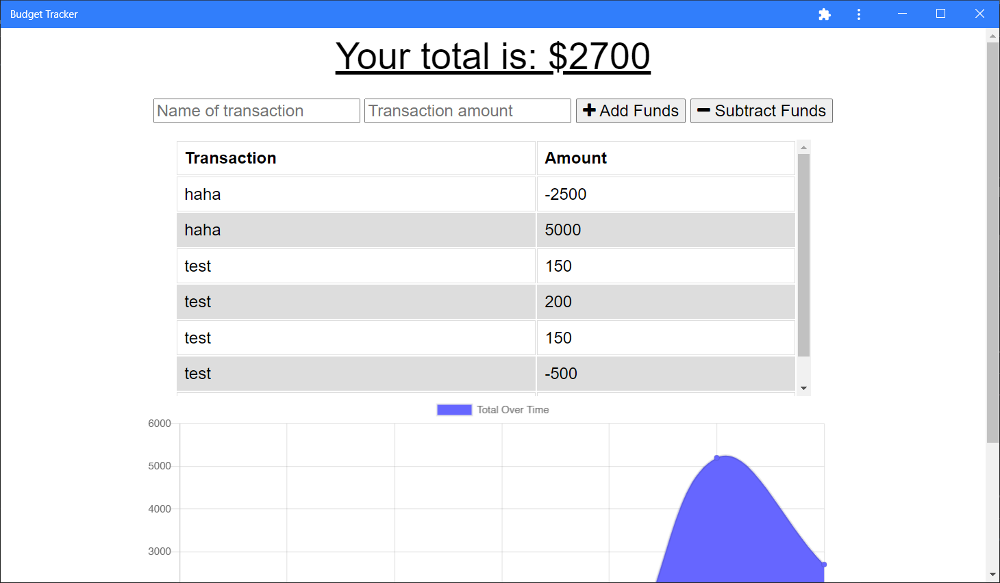

# Budget Tracker

## Table of Contents

  - [Description](#description)
  - [Installation](#installation)
  - [Usage](#usage)
  - [Credits](#credits)
  - [Version History](#version-history)
  - [License](#license)

## Description

Giving users a fast and easy way to track their money is important, but allowing them to access that information at any time is even more important. Having offline functionality is paramount to the success of an application that handles users’ financial information.

Your challenge this week is to update an existing budget tracker application to allow for offline access and functionality. The user will be able to add expenses and deposits to their budget with or without a connection. If the user enters transactions offline, the total should be updated when they're brought back online. Once you’ve made these changes, you’ll deploy the application to Heroku.

### User Story

```
AS AN avid traveler
I WANT to be able to track my withdrawals and deposits with or without a data/internet connection
SO THAT my account balance is accurate when I am traveling
```

### Acceptance Criteria

```
GIVEN a budget tracker without an internet connection
WHEN the user inputs an expense or deposit
THEN they will receive a notification that they have added an expense or deposit
WHEN the user reestablishes an internet connection
THEN the deposits or expenses added while they were offline are added to their transaction history and their totals are updated
```

## Installation

1. Navigate to the Heroku website [here]().
2. In the browser, click the button in the address bar that says "Install Budget Tracker".
3. That's it!

## Usage

To use this application, simply enter a transaction name and amount, then click the button corresponding to the type of transaction being made. This application can also be used offline, and all of the transactions entered will be uploaded to the backend database once a connection is reestablished.

Screenshot:



## Credits

1. [Mitchell George](https://github.com/mitchgeorge8)
2. [Starter code](https://github.com/coding-boot-camp/symmetrical-bassoon)

## Version History

- 1.0 - Initial release
  - See [commits](https://github.com/mitchgeorge8/budget-tracker/commits)

## License

&copy; 2022 [Mitchell George](https://github.com/mitchgeorge8)

Permission is hereby granted, free of charge, to any person obtaining
a copy of this software and associated documentation files (the
"Software"), to deal in the Software without restriction, including
without limitation the rights to use, copy, modify, merge, publish,
distribute, sublicense, and/or sell copies of the Software, and to
permit persons to whom the Software is furnished to do so, subject to
the following conditions:

The above copyright notice and this permission notice shall be
included in all copies or substantial portions of the Software.

THE SOFTWARE IS PROVIDED "AS IS", WITHOUT WARRANTY OF ANY KIND,
EXPRESS OR IMPLIED, INCLUDING BUT NOT LIMITED TO THE WARRANTIES OF
MERCHANTABILITY, FITNESS FOR A PARTICULAR PURPOSE AND
NONINFRINGEMENT. IN NO EVENT SHALL THE AUTHORS OR COPYRIGHT HOLDERS BE
LIABLE FOR ANY CLAIM, DAMAGES OR OTHER LIABILITY, WHETHER IN AN ACTION
OF CONTRACT, TORT OR OTHERWISE, ARISING FROM, OUT OF OR IN CONNECTION
WITH THE SOFTWARE OR THE USE OR OTHER DEALINGS IN THE SOFTWARE.
